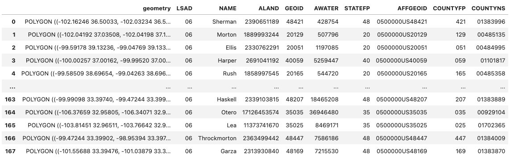
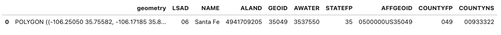
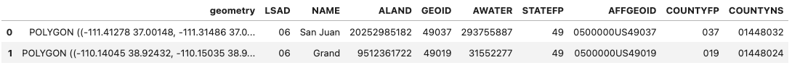
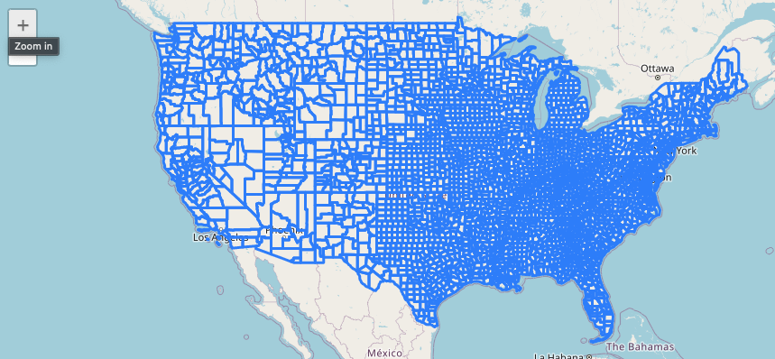
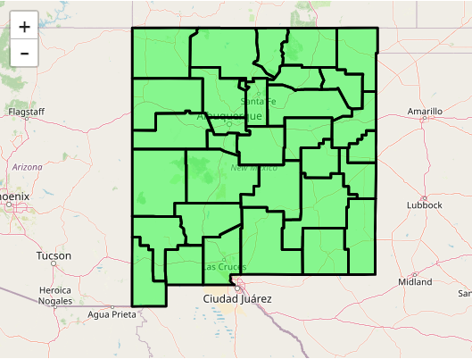

# Vector ⥂

Vector is a catalog for vector data. It enables users to store, query,
and display vector data — which includes everything from fault lines to
thermal anomalies to material spectra to ML detections.

This quick-start guide provides examples to demonstrate some of the
basic features of Vector. This guide's prerequisite is a notebook
environment that includes the EarthOne Python client and supports
ipyleaflet. Vector tables consist of features, which themselves consist
of a geometry and properties. The following geometry types are
supported:
`Point, MultiPoint, LineString, MultiLineString, Polygon, MultiPolygon`.

## Installation

If you are using Workbench, Vector will come already installed on your
Python environment. If you are using another environment, install the
EarthOne client from PyPI by running

``` bash
$ pip install earthdaily-earthone
```

If you wish to use the visualization features, then be sure to install
ipyleaflet also, or use the `viz` extra.

## Getting Started

Vector is available within the EarthOne client and can be imported into
a notebook with the following:

``` python
import earthdaily.earthone as eo
from earthdaily.earthone.utils import Properties
from earthdaily.earthone.vector import Table, models
from pydantic import Field
from typing import Union, Optional
```

## Creating a Vector Table

Vector tables to which a user has read access at minimum can be listed
by using the `list` method.

``` python
for table in Table.list():
  print(table.id)
```

In the above code example, the `id` property is being accessed with each
iteration, which will return the Vector table ID. Vector table IDs must
be unique within a given organization.

As this is an example notebook and table IDs must be unique, any
existing Vector table with the same table ID for this example will first
be deleted.

``` python
orgname = eo.auth.Auth().payload["org"]
for table in vector.Table.list():
    if table.id == f"{orgname}:us-counties":
        print(f"Deleting {table}")
        table.delete()
```

In the code above, Vector tables are listed and iterated over. If a
table already exists with the table ID equivalent to `us-counties`, it
will be deleted by calling the
`delete` method.

With any potential duplicate Vector tables now deleted, a Vector table
can created. Vector allows the user to define a custom schema/model for
each Vector table. Below is the list of predefined base models which
should be inherited to define the schema. If your data does not contain
a geometry column (i.e. aspatial), the model should inherit from
`VectorBaseModel` which will
inherit the required UUID column. If your data does contain a geometry
column, the appropriate model for the given geometry type must be
selected, which will inherit both the required UUID and geometry
columnns. If a multi-geometry model is selected, all geometries will be
promoted to multi-part.

``` python
models.VectorBaseModel # aspatial/tabular data only
models.PointBaseModel # data containing point geometries
models.MultiPointBaseModel # data containing multi-point geometries
models.PolygonBaseModel # data containing polygon geometries
models.MultiPolygonBaseModel # data containing multi-polygon geometries
models.LineBaseModel # data containing line geometries
models.MultiLineBaseModel # data containing multi-line geometries
```

Once the appropriate base model has been determined, a custom
model/schema can be created by inheriting the base model. Column names
and data types can then be attributed to the custom model/schema. Below
is the complete list of accepted data types.

``` python
class CustomModel(models.VectorBaseModel):
    column_a: str
    column_b: int
    column_c: float
    column_d: datetime.date
    column_e: datetime.datetime
    column_f: list
    column_g: dict
    column_h: bool
    column_i: List
    column_j: List[str]
    column_k: List[int]
    column_l: List[float]
    column_m: List[bool]
    column_n: List[dict]
```

By default, columns are not nullable. However, you can define a column
to be nullable by wrapping the data type with
`typing.Optional[data_type]` or `typing.Union[data_type, None]`. If the
Vector table has a geometry column, a spatial index will be created
automatically. To specify the creation of an index on another column,
use `pydantic.Field`. Examples for both cases are provided below.

``` python
class CustomModel(models.VectorBaseModel):
    column_a: Optiona[str] = Field(json_schema_extra={"index": True})
    column_b: Union[int, None]
```

For a more realistic example, we will create a Vector table pertaining
to US counties. The custom model/schema, `CountyModel`, inherits from
`MultiPolygonBaseModel`. Since
the UUID and geometry columns are inherited from the base model, we only
need to define the additional columns. Invoking the
`create` method will create the actual
table. This method requires a product ID, which will be prefixed with
`YOURORGNAME:`, a table name, and a table model/schema. Upon successful
creation, a `Table` object will be returned.

``` python
CountyModel(models.MultiPolygonBaseModel):
  STATEFP: str = Field(json_schema_extra={"index": True})
  COUNTYFP: str
  COUNTYNS: str
  AFFGEOID: str
  GEOID: str
  NAME: str
  LSAD: str
  ALAND: int
  AWATER: int

table = Table.create(
  product_id="us-counties", # ID for the table
  name="US Counties",  # Name for the table
  owners=[f"org:{orgname}"], # Table owners
  model=CountyModel 
)
```

## Ingesting Data

With the Vector table created, the table can be populated with features
using the following code:

``` python
import requests
url = "https://gist.githubusercontent.com/sdwfrost/d1c73f91dd9d175998ed166eb216994a/raw/e89c35f308cee7e2e5a784e1d3afc5d449e9e4bb/counties.geojson"
response = requests.get(url)
feature_collection = response.json()
gdf = gpd.GeoDataFrame.from_features(feature_collection["features"], crs="EPSG:4326")
gdf = table.add(feature_collection)
```

In the above code snippet, a GeoJSON feature collection was downloaded
from a webpage. The feature collection was then converted to a
GeoDataFrame and ingested to the table with the
`add` method. Adding features will
return a `GeoPandas.GeoDataFrame` with UUID attribution. If the Vector
table were aspatial (i.e. no geometry column), a `Pandas.DataFrame` with
UUID attribution would returned.

## Querying Data

### TableOptions

Vector products can be filtered/queried by specifying a
`property_filter`, `columns`, and `aoi`. In the case of Vector,
`property_filter`, `columns`, and `aoi` are collectively referred to as
`TableOptions`. Subsequent method calls on
the `Table` object will honor these options.

- `property_filter`: Property or column filter for the query. Default is
  no filter.
- `columns`: A subset of columns to return with each query. Default is
  all columns will be returned.
- `aoi`: Spatial filter for the query. Default is no spatial filter.

Setting the `TableOptions` can be done
during initialization of a `Table` object:

``` python
# initialize properties
p = Properties()

table = Table.get(
  f"{orgname}:us-counties",
  property_filter=p.NAME == "Santa Fe",
  columns=["geometry", "STATEFP", "NAME"],
)

df = table.collect()
```

updated after initialization:

``` python
table = Table.get(f"{orgname}:us-counties")
table.options.property_filter=p.NAME == "Santa Fe"
table.options.columns=["geometry", "STATEFP", "NAME"]

df = table.collect()
```

or overwritten entirely:

``` python
options = TableOptions(
  f"{orgname}:us-counties",
  property_filter=p.NAME == "Santa Fe",
  columns=["geometry", "STATEFP", "NAME"],
)
df = table.collect(override_options=options)
```

The table options can be reset to default at any point using the
`reset_options` method.

``` python
table.reset_options()
```

### Querying

As seen from the previous examples, calling the
`collect` method will execute a query
based on the specified `TableOptions`. Upon
successful completion, a `GeoPandas.GeoDataFrame` or `Pandas.DataFrame`
will be returned. If the table was spatial (i.e. has a geometry column)
and the columns option was not set or the geometry column was included
in the columns option, a `GeoPandas.GeoDataFrame` will be returned;
otherwise, a `Pandas.DataFrame` will be returned. The DataFrame will
only contain data for the columns specified in the options. More complex
queries can be constructed as seen below:

``` python
aoi = {
    "type": "Polygon",
    "coordinates": [
        [
            [-109.63936670604541,33.07321249994284],
            [-99.18198027219883,33.07321249994284],
            [-99.18198027219883,39.037426282400816],
            [-109.63936670604541,39.037426282400816],
            [-109.63936670604541,33.07321249994284]
        ]
    ],
}

table = Table.get(
  f"{orgname}:us-counties",
  aoi=aoi,
)

df = table.collect()
df
```



In the example above, invoking the
`collect` method returns a
`GeoPandas.GeoDataFrame` containing rows (counties) that intersected our
AOI. Since we did not set the columns option, all columns will be
returned.

``` python
table.reset_options()
table.options.property_filter = p.NAME == "Santa Fe"
gdf = table.collect()
gdf
```



In the example above, we have reset the
`TableOptions` which has cleared the AOI we
previoulsy specified. Now we have set the property filter to only
include rows (counties) named Santa Fe.

``` python
table.reset_options()
table.options.property_filter = p.STATEFP == "49"
table.options.aoi = aoi
gdf = table.collect()
gdf
```



Lastly, any combination of table options can be constructed to define a
query. In above example, we have reset the table options which has
cleared the previous property filter. We then set a new property filter
and AOI to only include rows (counties) that are in Utah (FIPS 49) and
intersect our AOI.

## Visualization

Working within a Python notebook, Vector tables can be visualized by
calling the `visualize` method which
will add a `VectorTileLayer` to the provided
map display. Note this method is only applicable to spatial Vector
tables.

``` python
m = ipyleaflet.Map(
    scroll_wheel_zoom=True,
    center=(44.5, -103)
)
m.zoom = 3
m

table = Table.get(f"{orgname}:us-counties")

table.visualize("US Counties", m)
```



In this example, an `ipyleaflet` map has been created centered over the
US. Invoking the `visualize` method
will add a layer displaying the features of the table to the map.

### Filtering Tiles

Similar to the query examples above, Vector visualization also supports
the use of `TableOptions`; however, only the
property filter and columns will be honored.

``` python
p = Properties()

table.options.property_filter = p.STATEFP == 35

# add layer style
vector_tile_layer_styles = {
    "default": {
        "fill": "true",
        "fillColor": "#00ff00",
        "color": "#000000",
        "fillOpacity": 0.5,
    }
}

table.visualize(
    name="New Mexico Counties",
    map=m,
    vector_tile_layer_styles=vector_tile_layer_styles
)
```



In this example, the `visualize`
method has been invoked with a property filter and layer style. Instead
of visualizing all US counties, only counties with a state FIPS code of
35, e.g. New Mexico. The layer added to the map display will be
formatted according to the `vector_tile_layer_style`.

## Deleting Tables

To delete a table, simply invoke the
`delete` method on a table object.

``` python
try:
    table = Table.get(f"{orgname}:us-counties")
    table.delete()
except:
    print("Table does not exist!")
```

In this example, retrieving and deleting a table are encapsulated in a
try/except block. When retrieving a table, if the table does not exist,
an error is raised.
