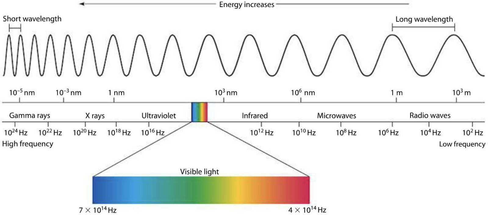

# Remote Sensing 101

## Introduction

Remote sensing is the science of gathering information about a location
from a distance. For example, sensors on board satellites record the
amount of emitted or reflected energy from the Earth’s surface, which
can then provide information to scientists about the condition of the
surface and provide insights to decision-makers.

## Sensors

Sensors are the actual instruments that collect data about the objects
they are observing by measuring the amount of energy returned to the
instrument. Sensors are often designed for particular applications, such
as monitoring the Earth’s temperature, land surface, or ocean floor, and
thus are built to record specific information from different parts of
the electromagnetic spectrum that are relevant to those applications.

!!! note
    Read more about sensor types and what datasets are available through
    the Cartesian Workbench.

### The Electromagnetic Spectrum

The electromagnetic (EM) spectrum describes the entire range of
frequencies of EM radiation that exists. Different portions or classes
of the EM spectrum can be broken out according to its frequency or
wavelength, including gamma rays (short wavelength, high frequency),
visible light (longer wavelength, lower frequency), and radio waves
(longest wavelength, lowest frequency). Portions of the electromagnetic
spectrum penetrate the atmosphere better than others, allowing earth
observation sensors to effectively detect frequencies within the
visible, infrared, and microwave spectrum.

Sensors are designed to record EM radiation within discrete ranges, or
bands. For example, optical sensors often have bands representing red,
green, and blue light. The exact range of wavelengths recorded for each
band varies by sensor. For example, Sentinel 2’s red band covers a
wavelength range of 650nm to 680nm, while Landsat 8’s red band records
data in the range of 635.8nm to 673.35nm. Wavelengths and band lengths
are typically expressed in nanometers or micrometers in remote sensing.

*The Electromagnetic Spectrum: Remote sensing instruments are designed to capture specific ranges of the electromagnetic spectrum. [miniphysics.com](https://www.miniphysics.com/electromagnetic-spectrum_25.html)*

### Passive sensors

Passive systems, like Landsat and MODIS, measure the amount of
electromagnetic energy being reflected from the Earth. We sometimes
refer to these as optical sensors, as they detect reflected visible,
near infrared, and short-wave infrared radiation. Various materials on
the Earth’s surface reflect energy differently, allowing us to classify
land cover and make other inferences about the planet using optical
data.

Thermal remote sensors measure radiation being emitted from the earth’s
surface or a target body, rather than reflected in the case of optical
sensors described above. Thermal energy registers in the thermal
infrared region of the electromagnetic spectrum and can be used to make
temperature measurements of the land or sea surface. Applications
include measuring the presence of irrigation leaks in agricultural
areas, modeling regional energy balances between land surfaces and water
bodies, and fire detection.

### Active sensors

Active sensors (like radar or lidar) do not rely on energy from the Sun
or Earth's thermal properties. Instead, active remote sensing sensors
transmit energy toward the Earth's surface, which then interacts with
the terrain and returns back to the sensor. Several active remote
sensing platforms use radar to scan the Earth’s surface. Radar has a
longer wavelength when compared to visual light, causing it to have
atmosphere and cloud-penetrating properties. Thus, radar data can be
especially useful for monitoring tropical areas that are covered in
clouds much of the year.

!!! note
    So far, work at EarthOne has used radar (e.g. Sentinel 1A), which
    transmits long wavelength microwaves (i.e. 0.75 - 25 cm), and LiDAR,
    which uses short wavelength laser light (i.e. 0.90 &mu;m).

## Platforms

Platforms are the objects that carry sensors. These can be stationary,
moving linearly, or orbiting. Many of the datasets hosted by EarthOne
collect imagery from sensors mounted on satellites in orbit. Others were
collected on special missions by attaching sensors to airplanes.
Satellite platforms can be in several types of orbits depending on their
mission. Most Earth observation satellites are in Sun synchronous, low
Earth orbit (Landsat, Sentinel). Sun synchronous orbits allow a
satellite to move with the Sun, maintaining a constant illumination
angle as it images the Earth.

For satellites that need to maintain a consistent view (weather
satellites), a geostationary orbit keeps the sensor over the same
location at all times. Geostationary orbits are often used to collect
data over large areas of the Earth very frequently. Airborne platforms
allow for greater flexibility with regards to how imagery is collected,
and can include airplanes, drones, or balloons. Imagery can also be
collected using ground-based platforms such as hand-held devices,
tripods, towers, or cranes.

## Resolutions

Remote sensing datasets have three main types of resolution associated
with them: spatial, temporal, and spectral. The choice of which
resolutions are the most important is dependent on the user’s
application.

- Computer vision (CV): A user is interested in counting the number of
  swimming pools in southeastern Florida. This will require images that
  can resolve relatively small objects to allow the CV model to identify
  the pools (spatial resolution), but likely will not require
  information from bands beyond the visible range (spectral resolution),
  or require multiple images of the study area (temporal resolution).
  Overall, the required spatial resolution will be high, while the
  spectral and temporal resolution requirements will be low. An ideal
  sensor here may be Airbus SPOT or Pléiades imagery.
- Vegetation Monitoring: A land manager is interested in monitoring
  vegetation growth over the course of the year. In order to separate
  healthy vegetation from areas with little to no growth, the sensor
  needs to measure bands covering various parts of the EM spectrum that
  are sensitive to vegetative growth, from the red to near/mid infrared
  regions. As the user is interested in getting regular updates
  throughout the year, the revisit rate (temporal resolution) should be
  relatively high. However, since the user is interested in broader
  spatial trends, very high spatial resolution is less important. In
  this case, Sentinel-2 would work well.
- Wildfire Detection: A user is interested in detecting fires across
  North America. In this case, there is a need to get very frequent
  updates (temporal resolution). The spectral range needs to include
  bands that are sensitive to high temperatures (midwave-IR, thermal-IR,
  and shortwave-IR). Given the large area of interest, the user is
  satisfied using data without very high spatial detail. For this
  application the GOES sensor, which images the western hemisphere every
  15 minutes, may be a good fit.

Generally speaking, users have to compromise on some element of
resolution. Technical limitations prevent a single sensor from capturing
data at high resolution in all three areas. Increasingly, with access
and the ability to take advantage of more diverse and larger datasets, a
user may achieve high resolution across all three areas by combining
data from different sensors.

Spatial resolution refers to the size of the ground element represented
by a single pixel. Generally, this is expressed as the size of a single
pixel along one side, e.g. the spatial resolution of the Sentinel-2 red
band is 10 meters. Most imagery in the Landsat archive has a spatial
resolution of 30 meters. At this resolution, one pixel is the size of a
baseball infield, however, to reliably detect an object in an image it’s
often recommended that the object should occupy at least 3-9 pixels,
depending on the sensor. Spatial resolution has major implications on
the size of the data stored on disk, legality of use, ease of access and
cost, and most importantly, what you can distinctly identify from the
imagery. If a user needs to count cars, Landsat will not meet their
spatial resolution needs, and they may need to save room in their
project’s budget for high resolution data.

Spectral resolution refers to the sensitivity of the sensor to resolve
fine ranges in the EM spectrum. A sensor with high spectral resolution
will contain information about very narrow spectral ranges (e.g. each
band may cover a 10nm range), while a sensor with a coarse spectral
resolution could contain a bands with information about a wide spectral
region (e.g. the entire visual range, about 400nm). Differences in
spectral range and resolution between satellites can have a meaningful
impact. It is particularly important for applications where the feature
of interest has a narrow absorption feature, such a mineral mapping,
meaning that signal of the feature is only distinct in a narrow range of
EM radiation.

Temporal resolution refers to the frequency of image updates for any
given location on the Earth. This is also called the satellite “revisit
rate”. Satellites that are collecting in sun-synchronous orbit will have
a regular revisit rate over a given location on Earth (e.g. Sentinel-2
will revisit a location either every 5-10 days depending on the
location), while satellites that must be tasked or aerial datasets will
have more irregular collection patterns. Temporal resolution is
important for monitoring applications, as well as for applications where
the temporal pattern of the signal is informative. For example, high
temporal resolution is often important for agricultural applications,
where the satellite can be used to track the growth phases of a crop
over the growing season.

## Image Correction

For optical imagery, the most scientifically useful quantity is
$\rho$, the percentage of incident radiation ($I$) that is reflected
from the surface and detected by the sensor (radiant flux $R$).
Conceptually, this is the fraction of the Sun’s light that is reflected
by the Earth’s surface.

$\rho\prime = R / I$

For a given spectral range, I can be estimated directly from a reference
Solar irradiance spectra. R is generally calculated directly from the
raw sensor data (e.g. digital number), using the sensor specific
conversion formula. To correct for the illumination angle of the sun
($\theta$), $\rho\prime$ can be adjusted based on a reflectance
model. The simplest model, Lambertian, removes illumination effects
using a cosine correction:

$\rho = \rho\prime / cos(\theta)$

The imagery is now considered corrected to ‘top of atmosphere’ (TOA),
meaning that the data are adjusted to model the reflectance measurement
at the top of the atmosphere. At this point the imagery needs to be
corrected for the effects of terrain (orthorectification) and distortion
resulting from the signal passing through the atmosphere (atmospheric
correction). Often the illumination correction is done at the same time
as the terrain correction, as the illumination angle of each pixel may
be different in rugged areas.

!!! note
    All imagery offered through the EarthOne data refinery has undergone
    some level of data correction described in this section, though the
    processing levels vary by sensor and band. All products have been
    georeferenced, optical imagery has been converted from raw digital
    numbers to top of atmosphere reflectance.

### Orthorectification

Orthorectification is the process of removing topographic, illumination,
and perspective effects from an image. When an image is collected,
terrain (e.g. mountains and valleys) can cause some areas to receive
different amounts of light, or to appear offset from their actual
position. Orthorectification corrects these irregularities, using a
digital elevation model of the area to normalize illumination across the
scene and to remove distortions due to the terrain.

### Atmospheric Correction

The atmosphere has an inherent influence on almost all remote sensing
data. Atmospheric conditions can change the amount of electromagnetic
radiation that reaches the Earth’s surface, and distort or diminish that
radiation as it travels back through the atmosphere to a sensor.
Atmospheric particles, the angle of the sun at the time the sensor was
triggered, and the weather on a given day will all greatly impact the
quality of an image. When a project requires utilizing imagery acquired
under different times and conditions, it is essential to remove the
effects of the atmosphere. When the effects of the atmosphere have been
removed, the imagery has been modeled to surface reflectance, or the
reflectance at which the sensor would record if it were just above the
surface of the Earth.
