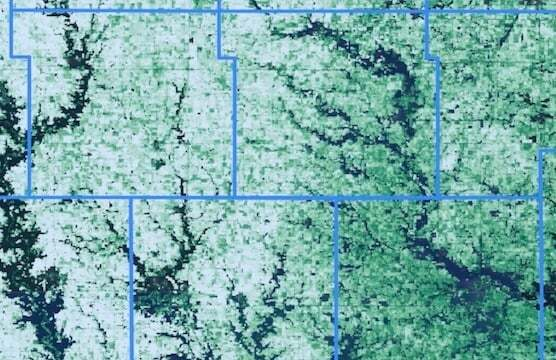
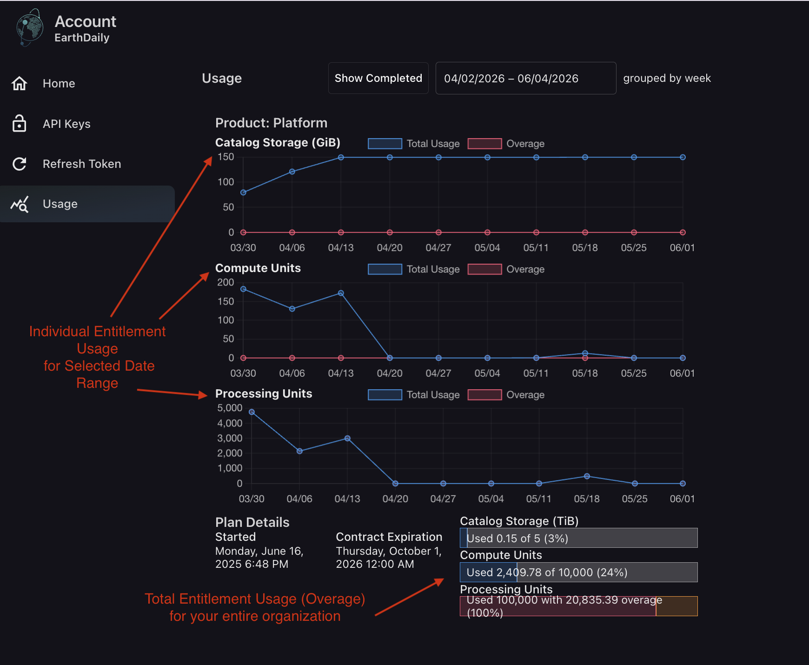

# Understanding Your Usage

## Learn how your usage is calculated

In many cases, it is helpful to know how much usage you will incur before kicking off a large modeling run, using Marigold, or even when you are just experimenting.

Purchase of EarthOne and services is currently enabled through an enterprise contract, and the usage discussed here is measured in units and billed on a per-unit basis. Contracts typically include a number of prepaid units which are referred to here as an *entitlement*.



### Viewing Your Usage

You can view usage associated with your individual account and monitor total contract entitlement utilization at <https://earthone.earthdaily.com/account/usage>.

Below is an example view of the Usage page:



### Entitlement Definitions - Processing Units

A Processing Unit is 1,000 tiles, where a tile is 512x512 pixels, with one band, and one timestamp.

Multipliers are applied for:

- Number of images
- Number of bands
- Size of AOI

To understand how many Processing Units a call will use, apply this formula:

```
tiles = ceiling(x_pixels/512) * ceiling(y_pixels/512)
processing_units = num_images * num_bands * tiles / 1000
```

It's important to note that the Processing Unit calculation includes alpha bands. If you are working with Catalog Products that have an alpha band, calls that don't specify `mask_alpha=False` will automatically include the alpha band. This information can be found in the documentation for the [Image](https://docs.earthone.earthdaily.com/descarteslabs/catalog/docs/image.html#descarteslabs.catalog.Image) and [ImageCollection](https://docs.earthone.earthdaily.com/descarteslabs/catalog/docs/image.html#descarteslabs.catalog.ImageCollection) rasterization methods:

**mask_alpha** (*bool or str or None, default None*) – Whether to mask pixels in all bands where the alpha band of all scenes is 0. Provide a string to use an alternate band name for masking. If the alpha band is available for all scenes in the collection and `mask_alpha` is `None`, `mask_alpha` is set to `True`. If not, `mask_alpha` is set to `False`.

It is also important to note that the ***requested resolution***, not the source resolution, contributes to Processing Unit utilization.

Processing Unit entitlements are honored by comparing contract usage to-date with the entitlement amount. For usage beyond the entitlement, Processing Units are metered. Each metering period, whole-number Processing Unit usage will be metered, with partial usage carried over to subsequent metering periods.

#### EarthOne Platform Example 1: Stacking Imagery

For example, if you are pulling a stack of 10 images with RGB and Near-Infrared bands from a Catalog product with an alpha band (and you do not specify `mask_alpha=False`), and your AOI is 1024x1024 pixels:

```
tiles = ceiling(1024/512) * ceiling(1024/512) = 4
processing_units = 10 * 5 * 4 / 1000
# 0.2 Processing Units
```

If you performed the same operation but for 1,000 AOIs instead of just one, you would use 200 Processing Units.

#### EarthOne Platform Example 2: Many Small Fields

AOIs smaller than 512x512 pixels will not reduce the number of Processing Units consumed. For instance, if you have 5,000 agricultural fields (AOIs), each 10-30 pixels on each side, and want to pull 12 bands from the most recent image for each of those:

```
tiles = ceiling(30/512) * ceiling(30/512) = 1
per_field_pu = 1 * 12 * 1 / 1000 = 0.012
total_pu = 5000 * 0.012
# 60 Processing Units
```

If you performed this operation every week, you could expect to consume 60 Processing Units weekly for a total of 3,120 Processing Units for the year.

#### EarthOne Platform Example 3: Using DLTiles

If you already have a geometry over which you would like to estimate Processing Unit usage, you can use the [DLTile](https://docs.earthone.earthdaily.com/descarteslabs/geo/readme.html#descarteslabs.geo.DLTile) to arrive at a rough estimate. In the below example, we take **a geometry roughly the size of the US State of Colorado** and estimate the total number of Processing Units consumed at 10m resolution. Here we define a list of DLTiles **at 10m resolution** with a size of 512x512 pixels to arrive at an estimate of **roughly 10.8 Processing Units per band per timestamp**:

```python
import descarteslabs as dl
import shapely.wkt

wkt_str = 'POLYGON ((-108.96512108819677 40.99679679363058, -101.95231013633367 41.03392943599869, -102.02612919898459 36.97250181130221, -109.06354650506503 36.97250181130221, -108.96512108819677 40.99679679363058))'
geom = shapely.wkt.loads(wkt_str)

dltiles = dl.geo.DLTile.from_shape(
    geom, resolution=10,
    tilesize=512, pad=0,
    keys_only=True
)

len(dltiles)/1000
## ~10.8 PUs per band per timestamp
```

#### Sample Python Calculation

```python
import math

def get_pu_used(num_scenes, num_bands, arr_shape):
    """
    Calculate the Processing Units consumed by a scenes call

    Parameters
    ----------
    num_scenes : int
        The number of scenes in the request. Typically `len(scenes)`
    num_bands : int
        The number of bands in the request, including alpha or other mask band
    arr_shape : tuple of array shape (x, y)
        The x and y shape of the returned array in pixels.
        Typically array.shape[-2:] when the spatial dimensions are the last two (the default)

    Returns
    -------
    processing_units : float
    """
    pixels_x, pixels_y = arr_shape

    blocks_x = math.ceil(pixels_x/512)
    blocks_y = math.ceil(pixels_y/512)
    blocks_total = blocks_x*blocks_y

    processing_units = num_scenes * num_bands * blocks_total / 1000
    return processing_units

get_pu_used(10, 5, (1024,1024))
# 0.2

5000 * get_pu_used(1, 12, (30,10))
# 60
```

### Entitlement Definitions - Catalog Storage

Catalog storage is consumed by storing data in the EarthOne Catalog. The total storage used is calculated by adding up the file sizes for files stored in the Catalog.

Catalog Storage entitlements are honored by comparing usage each metering period with the entitlement amount. For storage beyond the entitlement, Catalog Storage is metered daily by the GiB-day. Each metering period, usage less than one GiB-day will be rounded up to 1 GiB-day. For each subsequent GiB-day, usage will be rounded to the nearest integer.

#### Example

If your contract specifies an entitlement of 4 TiB and you store 5 TiB of data in the Catalog every day for a month, you would be metered for 1 TiB. In terms of GiB-days, this would amount to 1,024 GB-days x 30 days, or 30,720 GB-days.

### Entitlement Definitions - Compute Units

For contracts specifying a Compute Unit entitlement, Compute Units are consumed through the use of EarthOne Compute services. A Compute Unit is measured as the number of CPU-hours consumed. Factors such as GPU usage, memory requested, and additional instance configuration may affect the number of Compute Units used.

### Other Usage Calculation & Metering Info

- Unless otherwise noted, Processing Unit usage is metered every hour and Catalog Storage usage is metered every day.
- Unless otherwise noted, Processing Unit usage is aggregated on a per-user and per-hour basis prior to being metered.
- Usage within your entitlement can be viewed at <https://earthone.earthdaily.com/account/usage>. This interface also allows for viewing detailed real-time account-specific usage.
