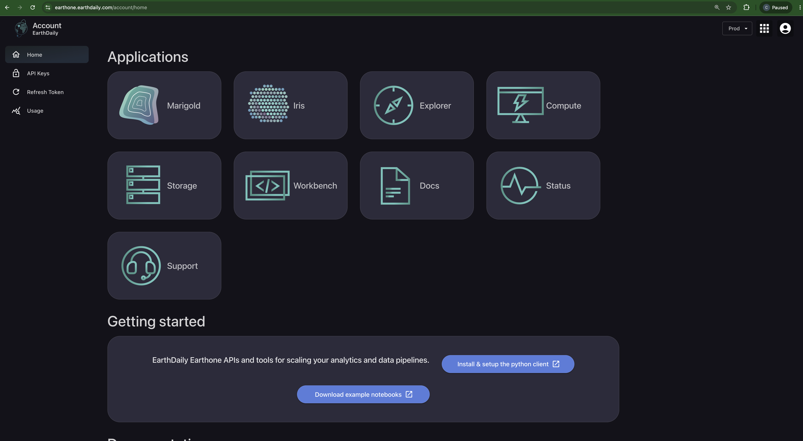
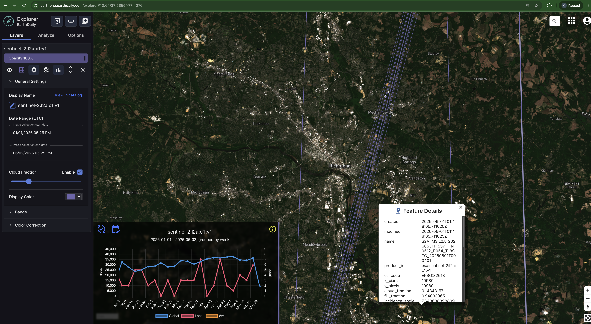
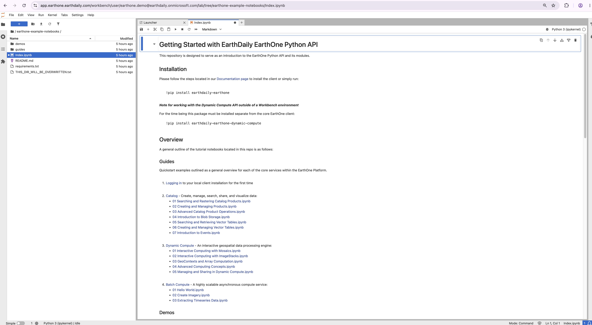
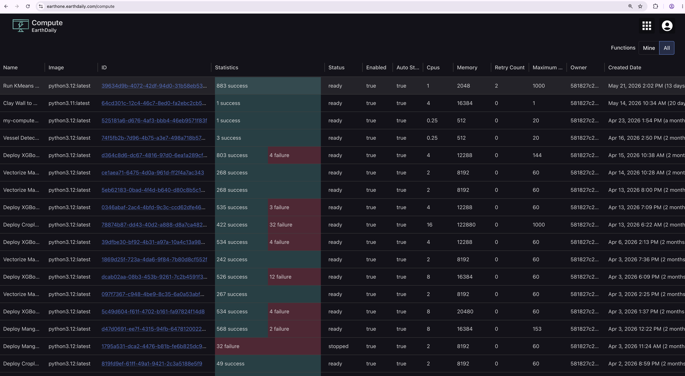
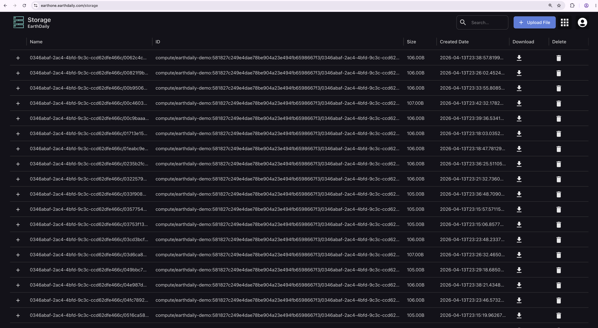

# EarthOne User Interfaces

## Let's make sure you have everything you need to get up and running with the EarthOne Platform

By now you should have been able to create an account, verify your email, and log in to your account. If you do not have an account, please reference the article [Getting Access to the Platform](../getting-started/access.md).

### Logging in to the portal

First, ensure that you are logged in by going to [earthone.earthdaily.com](https://earthone.earthdaily.com/) and signing in using the credentials you created during the setup process. Once logged in, this will be your landing page to access all of the EarthOne Platform User Interfaces (UIs) and documentation.

### Overview of User Interfaces

#### Explorer

The [EarthOne Explorer UI](http://earthone.earthdaily.com/explorer) provides users with the ability to search and visualize data products that are available on the Platform. By utilizing Explorer, users can easily become familiar with different data products and their associated metadata. Additionally, Explorer leverages the Catalog to enable users to manage their own datasets, offering a comprehensive solution for data exploration and management.

#### Workbench

[Workbench](http://earthone.earthdaily.com/workbench) is a hosted development environment specially tuned to work with the Descartes Labs Platform APIs. Learn more about managing your Workbench in the [Workbench Setup](./workbench.md) KB article.

#### Compute

[Compute](https://earthone.earthdaily.com/compute) is a web application designed to track, manage, and visualize your ongoing asynchronous Batch Compute Functions and their associated Jobs.

#### Storage

Upload, download, and share Storage Blobs in the [Storage UI](https://earthone.earthdaily.com/storage).

