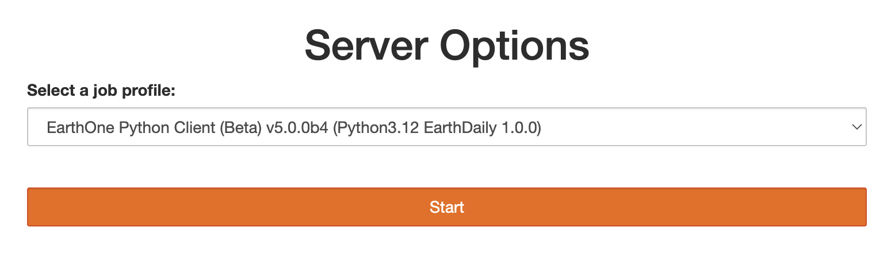

# Workbench Setup

## Getting started with Workbench

### Choosing your environment

When you start your [Workbench](https://earthone.earthdaily.com/workbench) session you should see a dropdown box similar to the screenshot above. You will find the latest EarthOne Python client release version, alongside the 2 most recent releases, with and without a GPU. We recommend you use the latest version of the CPU-enabled environment (first option, selected by default) unless you have specific requirements otherwise.

All environments will take a few minutes to spin up; GPU-enabled environments will take a little longer.

If you would like to change the Workbench environment after startup, simply click **File > Hub Control Panel** to stop and restart your VM and choose a different base environment.

### Navigating Workbench

Once logged in, you will find by default a directory called `example-notebooks`. These are a series of public-facing tutorial notebooks designed to get you acquainted with the basic access patterns as well as a number of demo spatiotemporal pipelines. You can always access the latest of these notebooks at [https://github.com/earthdaily/earthone-example-notebooks](https://github.com/earthdaily/earthone-example-notebooks/).

> **Note!** The `example-notebooks` directory is re-cloned upon every Workbench server restart. You can add to and modify files on your Workbench disk, but be sure not to make any changes you want saved inside the `example-notebooks` directory.

### Authenticating in Workbench

Before running any EarthOne Python code, you must first authenticate your instance. In the file manager, navigate into the `example-notebooks` folder and open the file `guides/01 Logging In.ipynb`. This Jupyter notebook will walk you through the steps to authenticate.

### Environment Management

Feel free to create your own virtual environments in this workspace, with both `conda` and `pip` pre-installed.

### Troubleshooting

#### I can't log in to Workbench / I'm stuck in a login loop!

You don't have access to Workbench. Contact [dl.support@earthdaily.com](mailto:dl.support@earthdaily.com) if you believe you should have access.
