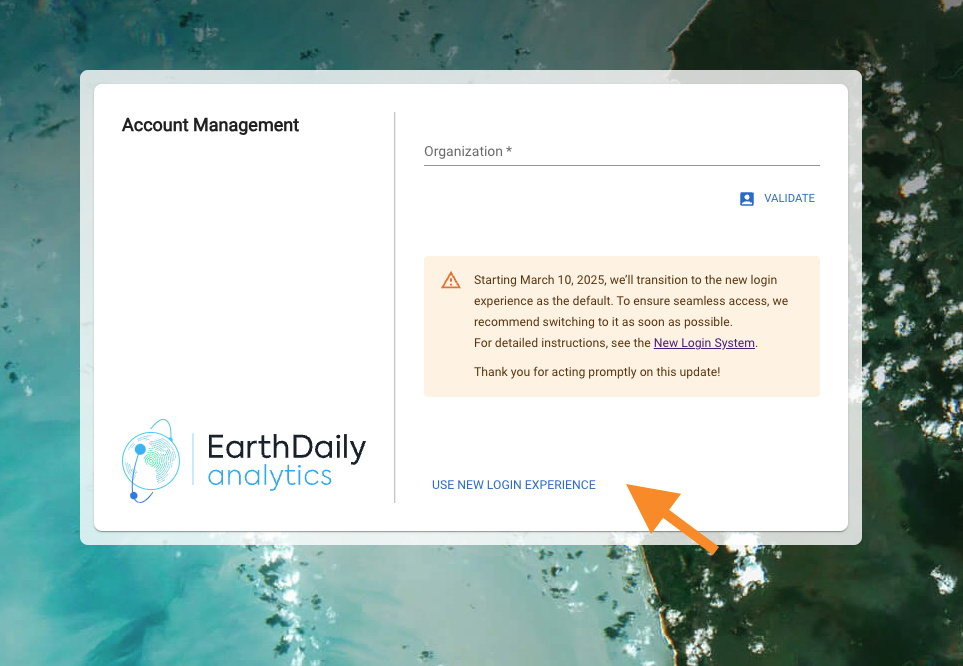
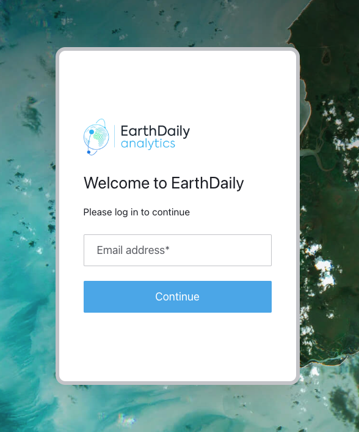

# Help and Frequently Asked Questions

For any support related questions please send your feedback to edasupport@earthdaily.com

## New Login System

EarthDaily has introduced an enhanced authentication system for all EarthDaily Console sites. This upgrade represents an improvement in security infrastructure and lays the foundation for advanced security features in the future.

For full details see: [New Login Experience](../console/new-login.md)

### How to access the new login experience

To access the new login system, look for the **Use New Login Experience** link in the bottom of the login box.

Clicking the link will take you to the new login flow:

- **Verifying the new flow:** Check [here](../console/new-login.md#verifying-that-youre-using-the-new-login-flow)
- **Setting up your password:** Check [here](../console/new-login.md#setting-up-your-password)
- **API Authentication:** Check [here](../console/new-login.md#api-authentication)

## Transition to New Login Experience

On **March 10, 2025** EarthDaily switched to the new authentication system as default for all EarthDaily Console sites. See [New Login Experience](../console/new-login.md) for details.

Please note:

- It is still possible to use the Legacy login system as an option on the login page
- You need to replace your old API keys with newly provisioned API keys as described in [API Authentication](../console/new-login.md#api-authentication)
- Your old API credentials will be **deleted** when the legacy authentication system is decommissioned. We strongly recommend testing and transitioning to the new API token system as soon as possible to ensure uninterrupted service.

## Need Help?

Our support team is available to assist you. Please don't hesitate to reach out if you have any questions or encounter any issues.
