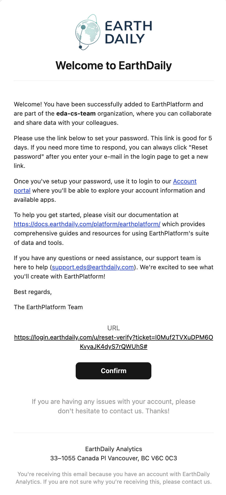
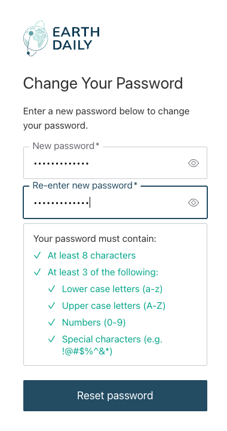
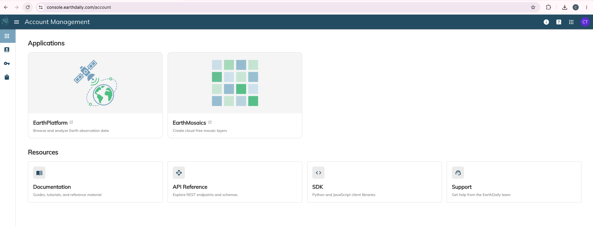

## Welcome to the EarthDataStore!

The [EarthPlatform](https://console.earthdaily.com/) is a user interface for the EarthDaily STAC API which allows for searching and visualizing STAC assets as well as access credential management. 

To get started, look out for an email in your inbox from EarthDaily asking that you set a password:

1. Welcome Email Example:

2. Password Form:

3. Console Landing Page:

## You're in!

Next, move onto the [Authentication](authentication.md) page to provision a new API key.
