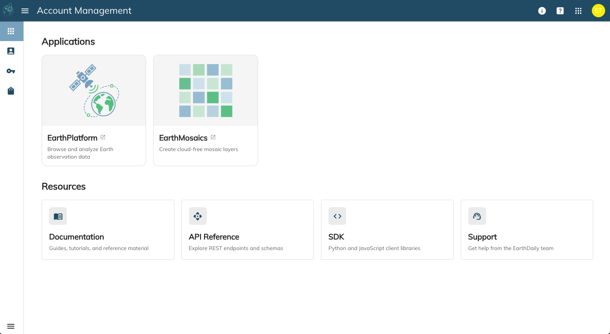
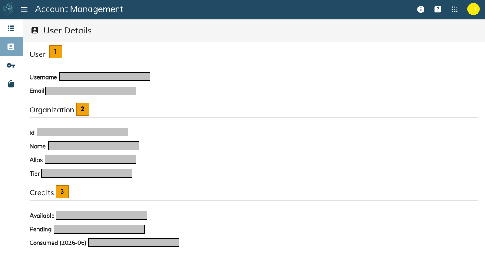
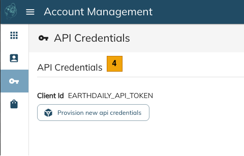
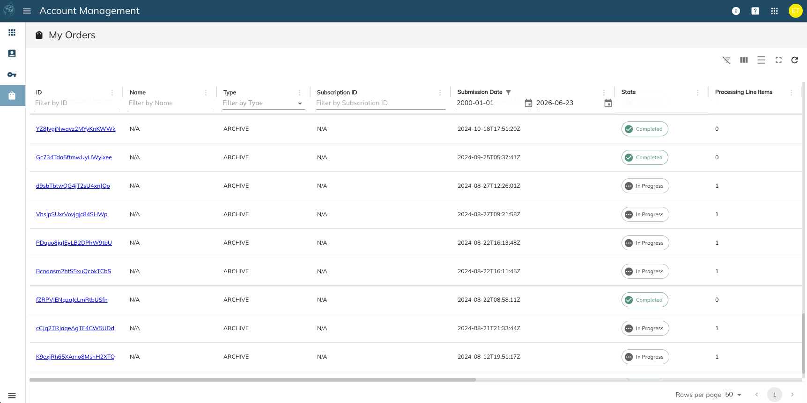

# Account Information

## Introduction

The Account Information page is the landing page for each user of the customer account when they login to [Account Information](https://console.earthdaily.com/account). It allows the user to check their own account details, orders, and more. It also has links to other applications like EarthPlatform and EarthMosaics.

## Landing Page

Upon logging in, the user arrives at the Landing Page, which shows the applications that the user has access to, and provides links to a rich set of resources:

On the upper right hand side of the window, you will see the following small icons:

| Icon | Description |
|------|-------------|
|  | About page that shows the EarthDaily version |
|  | Links to report issue, contact us, and learn more |
|  | Shows a list of hosted applications from EarthDaily; use it to switch between different applications |
|  | Quick information about the signed-in user along with their account and an option to sign out. The user's initials are shown. |

## User Details

From the left menu, the user can access the User Details page.

| S. No | Label | Description |
|-------|-------|-------------|
|  | User | Logged in user details |
|  | Organization | Details of the organization that the user belongs to |
|  | Credits | [Preview] Shows credits information of the user's organization. Note that this is a Preview feature. |

## API Credentials

From the left menu, the user can access the API Credentials page.

| S. No | Label | Description |
|-------|-------|-------------|
|  | API Credentials | Generate "Bearer Token" for API authentication. [Details of How to Provision](../getting-started/authentication.md) |

## My Orders

From the left menu, the user can access the My Orders page. This section allows you to see all the orders placed by the users on the account. You can see the Order details and the order state.

### Order State

| State | Description |
|-------|-------------|
| In Progress | Order is in progress. |
| Error | Order has failed, usually due to a downstream outage. |
| Completed | Order has completed successfully. Ready for download. |
