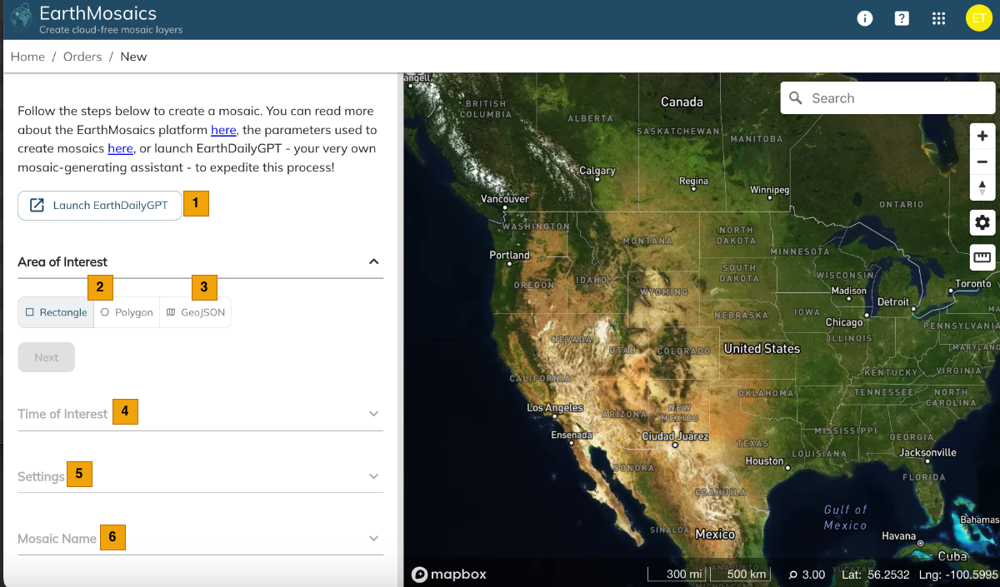
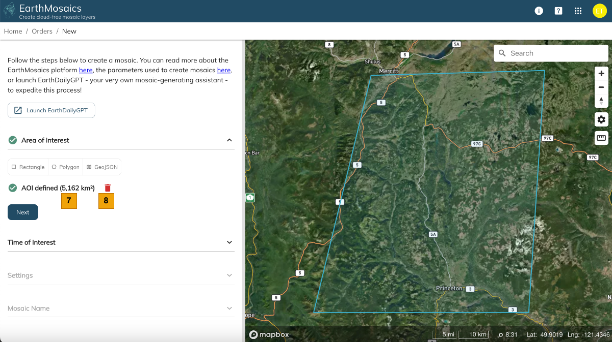
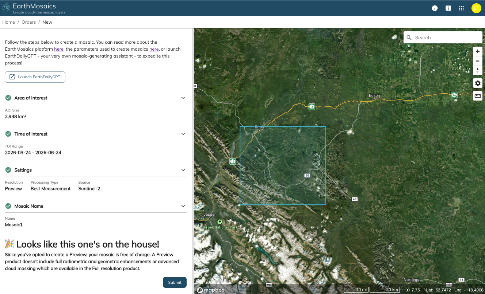
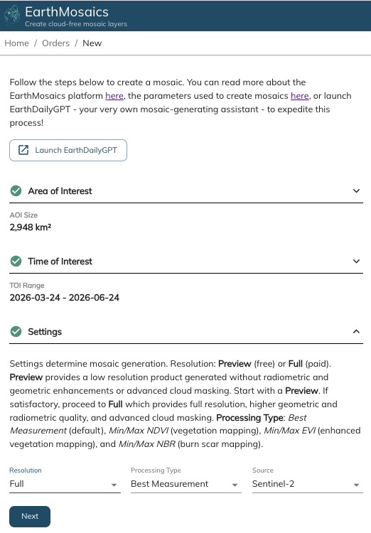
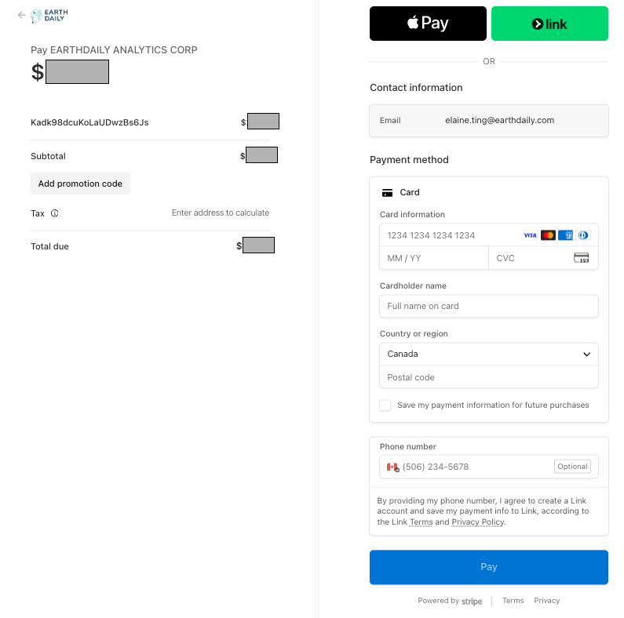
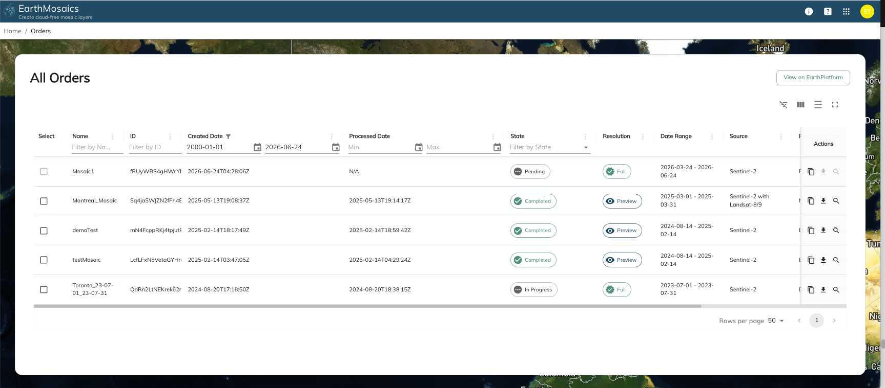
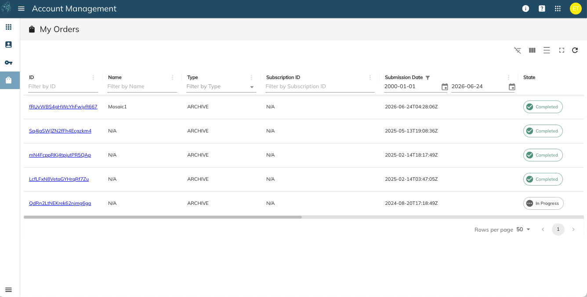
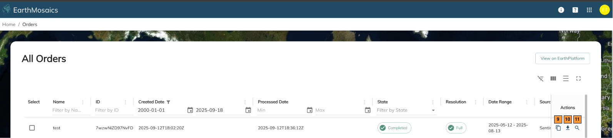
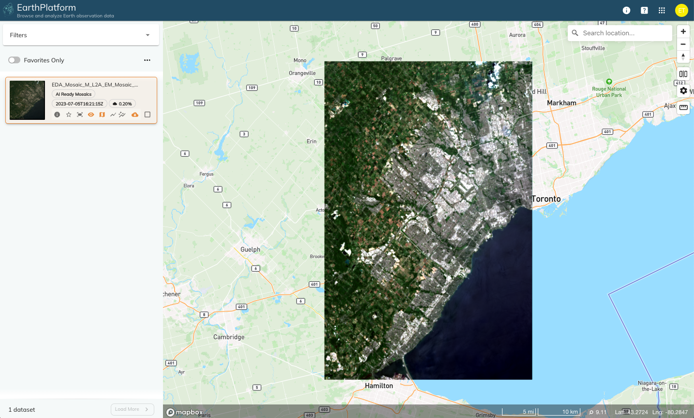

# EarthMosaics

## Introduction

[**EarthMosaics**](https://console.earthdaily.com/mosaics) delivers cloud-free, temporally coherent mosaics with the highest possible geolocation, radiometric quality, enabling users to examine true signals, minimize false positives in change detection, and easily contextualize with other geospatial datasets. From analysing a regional forest to monitoring a mining site, predicting water reservoir levels to measuring melting permafrost, EarthMosaics offers application-specific and customized insights fulfilling unique needs of each use case.

AI Ready Mosaics are complex, costly to produce, and designed to feed directly into ML applications.

[EarthMosaics](https://console.earthdaily.com/mosaics) from EarthDaily Analytics provides you a way to explore and get a free preview and you can also place orders for full resolution Mosaics.

## Getting started with Mosaics

Below is the landing page when you navigate to [EarthMosaics](https://console.earthdaily.com/mosaics):

Pressing `New Order` takes you to the New Orders page:

| S. No | Label | Description |
|-------|-------|-------------|
|  | Launch EarthDailyGPT | Use EarthDailyGPT to assist with generating a mosaic |
|  | Area of Interest - draw on map | Draw a polygon for your mosaics order (limit > 25km² and < 200,000 km²). Only polygons supported (not multipolygons) |
|  | Area of Interest - use GeoJSON | Enter an existing GeoJSON instead of drawing (same area limit) |
|  | Time of Interest | Specify the time of interest |
|  | Settings | Multiple choices to configure your order |
|  | Mosaic Name | Enter a name for easy identification |

The AOI defines the geographic extent used to build the mosaic. You can either draw the AOI on the map or provide GeoJSON. To draw, choose Rectangle or Polygon option, then left-click on the map.

Once you draw a polygon, the area calculator displays the total area:

| S. No | Label | Description |
|-------|-------|-------------|
|  | AOI Area | Displays the total area of the AOI |
|  | Delete | Delete the existing AOI |

You can view the AOI in GeoJSON:

Here are the ToI settings:

## Mosaic Preview Order

The settings define how your mosaic will be generated:

- **Resolution** — Preview is free, Full is paid. Create a Preview first to verify your settings.
- **Processing type** determines pixel selection:
    - **Best Measurement:** considers cloud, cloud shadow, distance to nearest occlusion, aerosol optical thickness, relative acquisition time, acquisition platform, and smoothness characteristics
    - **Min/Max NDVI (beta):** augments Best Measurement with per-pixel NDVI weighting
    - **Min/Max NBR (beta):** augments Best Measurement with per-pixel NBR weighting
- **Source** — Sentinel-2A only, or combination of Sentinel-2A and Landsat-8/9

After confirming settings and entering a name, submit the order:

## Mosaic Full Resolution Order

Full Resolution orders are similar to Preview except with an additional payment step.

Preview orders have 2 steps: Configuration and Confirmation.
Full Resolution adds a third step: Quote.

Select "Full" as your Resolution setting:

Confirm the order settings to checkout:

The checkout screen shows the order price:

If you have coupons to redeem, enter the coupon code for eligible discounts. Once ready, proceed to pay.

## Managing Mosaics Orders

After placing the order (Preview or Full), you will be redirected to your Dashboard:

Click "View All" to see all your Orders. Your order will show an "In Progress" state. There is a button to view all Mosaic Orders on EarthPlatform:

You can also use the Application Switcher to go to your Account Management page, and then go to the "My Orders" page to see your Order:

Click the Order Id link for more details:

Once processed successfully, the state changes to "Completed" with additional options:

| S. No | Label | Description |
|-------|-------|-------------|
|  | Copy | Copy the order to reuse settings or make minor modifications |
|  | Download | Download your product (Preview or Full) |
|  | View | View the product in EarthPlatform |

The [EarthPlatform](earthplatform.md) visualizer opens in a new tab:

## AI Ready Mosaic Creation Parameters

EDA's AI-Ready Mosaics (ARMs) are produced using proprietary algorithms to create cloud free, temporally coherent images ready for machine learning algorithms or mapping activities. The customization of sources, location, time, and method allow for a mosaic suited for specific analysis purposes.

ARM mosaics are produced with 6 bands from the four possible input sources:

- Sentinel-2A
- Sentinel-2B
- Landsat-8
- Landsat-9

All input data is level 2A meaning atmospherically corrected, surface reflectance products.

### Single Source (Sentinel-2A/B) Mosaics

| ARM Band Name | Sentinel-2 A/B Band | Approx. Center Wavelength (um) |
|---------------|---------------------|-------------------------------|
| coastal | Band 1 - Coastal | 0.443 |
| blue | Band 2 - Blue | 0.490 |
| green | Band 3 - Green | 0.560 |
| red | Band 4 - Red | 0.665 |
| rededge1 | Band 5 - Vegetation Red Edge | 0.705 |
| rededge2 | Band 6 - Vegetation Red Edge | 0.740 |
| rededge3 | Band 7 - Vegetation Red Edge | 0.783 |
| nir | Band 8 - NIR | 0.842 |
| nir08 | Band 8A - NIR | 0.865 |
| swir16 | Band 11 - SWIR | 1.610 |
| swir22 | Band 12 - SWIR | 2.190 |

### Dual Source (Sentinel-2A/B + Landsat8/9) Mosaics

| ARM Band Name | Sentinel-2 A/B Band | Landsat 8/9 Band | Approx. Center Wavelength (um) |
|---------------|---------------------|------------------|-------------------------------|
| coastal | Band 1 - Coastal | Band 1 - Coastal | 0.443 |
| blue | Band 2 - Blue | Band 2 - Blue | 0.490 |
| green | Band 3 - Green | Band 3 - Green | 0.560 |
| red | Band 4 - Red | Band 4 - Red | 0.665 |
| nir08 | Band 8A - NIR | Band 5 - NIR | 0.865 |
| swir16 | Band 11 - SWIR | Band 6 - SWIR 1 | 1.610 |
| swir22 | Band 12 - SWIR | Band 7 - SWIR 2 | 2.190 |

## Area of Interest (AOI)

Defines the geographic extent used to build the mosaic and is a key component for mosaic generation price. The AOI should be > 25km² and < 200,000 km².

## Time of Interest (TOI)

The time of interest will dictate the amount of available data the mosaic system can draw from. Limiting the TOI can deliver poor results if there is no cloud-free data within the specific AOI and TOI. The TOI should be after 2016-11-01T00:00:00.000Z, and with a minimum duration of 10 days.

## Mosaic Settings

### Resolution Selection

#### Preview Mosaic

The preview mosaic is used to ensure the combination of data source, AOI, and TOI is going to be viable for a given mosaic region. It will allow you to see the expected output of a Full Resolution mosaic in a fraction of the time. While the Preview doesn't apply all the improvements of Full Resolution (geometric, radiometric correction, aerosol-optical thickness weighting, or deep-learning cloud masks), it can still be used to get a sense of the expected cloud cover and visual consistency.

Once the parameters are to your liking, a full resolution mosaic can be produced with the same settings.

#### Full Resolution

This is the setting to use for a full mosaic product. Note this will have a price associated with it and may still produce clouds if the settings for input data are too narrow. It is advised you preview any mosaic first to ensure usability.

## Pixel Selection

#### Best Measurement

ARM's 'Best Measurement' extends work by [White et. al (2014)](#reference) and includes pixel-by-pixel weighting for several factors such as: sensor platform, scene content (clear, cloud, cloud shadow, water, snow), spatial distancing from measurement contamination, and aerosol optical thickness. This algorithm can produce highly consistent results where the goal is to choose the most representative sample for a given time period.

#### Peak Normalized Difference Vegetation Index (Coming Soon)

ARM's 'Peak NDVI' seeks to maximize the vegetative signals from the mosaic process, targeting conditions with the most vigorous vegetation signal.

#### Peak Burn Severity (Coming Soon)

ARM's 'Peak Burn Severity' seeks to maximize the response from burned pixels in order to map fire extent and degree of burn over large vegetated regions. To achieve peak burn severity, the Normalized Burn Ratio (NBR) is used to inform the pixel selection process. This mode can be sensitive to date selection and should be informed by knowledge of the local fire conditions and timing.

#### Percentile

ARM's Percentile selection uses a purely statistical approach to identify common pixels from the stack of images. This approach can be very effective with larger volumes of data. This is a classical approach to pixel selection, but generally has poorer results compared to Best Measurement.

## Source

Select if your mosaic will be made using only Sentinel-2A/B or the combination of Sentinel-2A/B and Landsat-8/9.

## Reference

[White, J. C., Wulder, M. A., Hobart, G. W., Luther, J. E., Hermosilla, T., Griffiths, P., Coops, N. C., Hall, R. J., Hostert, P., Dyk, A., & Guindon, L. (2014). Pixel-Based Image Compositing for Large-Area Dense Time Series Applications and Science. In Canadian Journal of Remote Sensing (Vol. 40, Issue 3, pp. 192-212). Informa UK Limited.](https://doi.org/10.1080/07038992.2014.945827)
